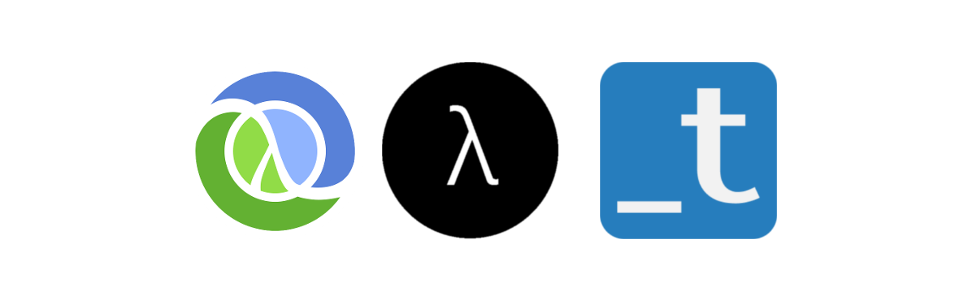

# (ns clojure-study-group)

Repositório do grupo de estudos sobre Clojure e Programação Funcional do [Training Center](https://github.com/training-center/sobre).

  

## Como funciona

Este grupo se destina ao estudo da linguagem Clojure e o paradigma de programação Funcional.

Conforme [outros grupos de estudos](https://github.com/training-center/study-groups) da comunidade Training Center, nós temos um [roadmap](material/roadmap.md) de tópicos para estudar juntos e fazemos hangouts semanais sobre o assunto que são gravados e disponibilizados no YouTube, no [canal do Training Center](https://www.youtube.com/c/TrainingCenterChannel).

## Como participar

Basta responder [este formulário](https://woliveiras.typeform.com/to/GMPv1z) para sabermos seu nível de conhecimento, entrar no [Slack do Training Center](https://github.com/training-center/slack) e entrar no canal **#clojure-studies**.

## Hangouts

- [pauta](/material/agenda)
- [ata](material/minutes)

## Material de apoio ao grupo de estudos de Clojure

- [livros](material/dir/books.md)
- [comunidades](material/dir/communities.md)
- [cursos](material/dir/courses.md)
- [eventos](material/dir/events.md)
- [newsletters](material/dir/newsletters.md)
- [sites](material/dir/sites.md)
